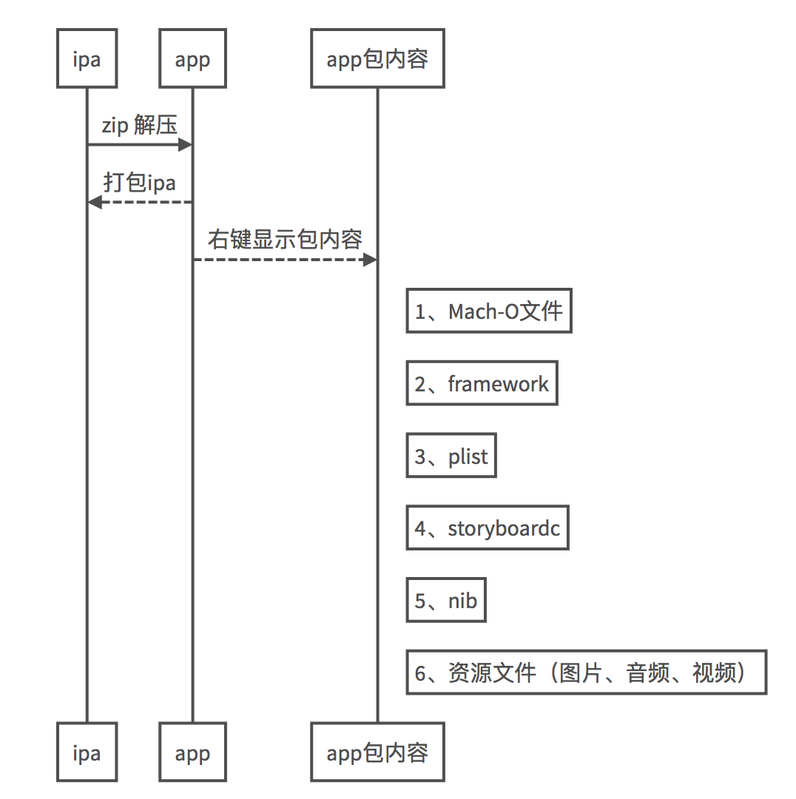
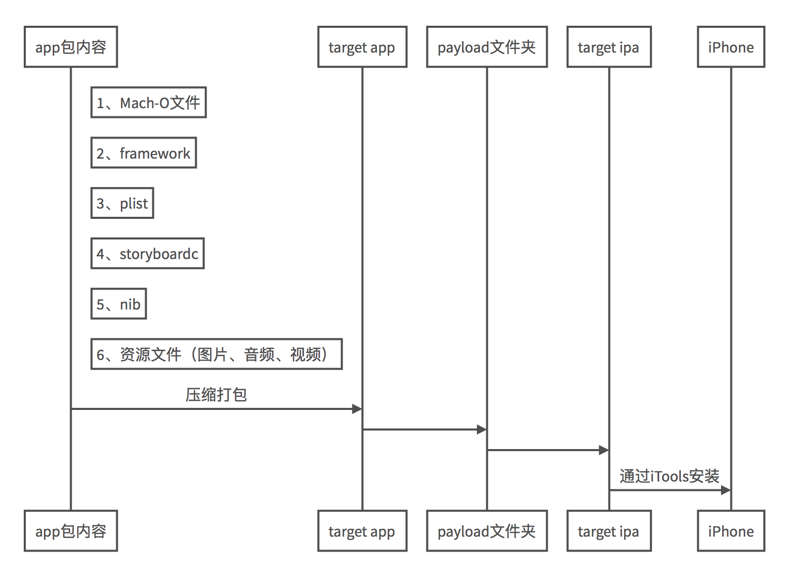

# 一、如何获取App

## 使用iTools工具
1. 使用iTools获取，点击导出按钮，导出成功后，可以获取ipa文件。
2. 使用终端输入 `file + ipa文件名` ，可以查看到ipa的类型，我们可以发现是一个zip的压缩包。
3. 把ipa解压后，可以得到

    1.  Container，这个文件夹是iTools帮我们导出的沙盒目录；
    2.  iTunesArtwork 图标（iTunes上显示的）；
    3.  iTunesMetadata.plist iTunes上的配置文件；
    4.  Payload文件夹，包含了一个App包（是一个文件夹)，右键显示包内容，可以查看到App的文件结构，里面包含了第三方的framework、plist配置文件、storyboardc、nib、图片音视频等资源文件、可执行文件(与App同名)
    
5. 查看命令：

    1. 可以用 `file命令` 查看该文件是Mach-O文件。
    2.  `lipo -info + 文件` 查看该文件的架构类型。
    3.  `nm -nm + 文件 | less` 查看可执行文件包含的符号。
    4. 使用 `otool -L 文件 | less ` 查看可执行文件编译的库。
    5. 二进制文件中包含的是机器码，我们可以使用 `otool -tV + 文件 | less` 来查看二进制文件中的汇编代码。

**App的包含关系：**

```sequence
ipa->app:  zip 解压
app-->ipa:  打包ipa
app->app包:  右键显示包内容
Note right of app包: 1.Mach-O文件
Note right of app包: 2.framework
Note right of app包: 3.plist
Note right of app包: 4.storyboardc
Note right of app包: 5.nib
Note right of app包: 6.资源文件（图片、音频、视频）
```



# 二、构建App
## 1. Xcode自动构建App

流程： 源代码 -> App -> 安装到手机

-  打开Xcode，command + b 编译程序，编译完成后，选择show the Report Navigator（即工具栏最后一个，用快捷键command + 9 也可以），选择By Time，选中第一个，即可查看到Build的整个流程。


-  点开详情，可以看到每一步编译的具体的操作。编译过程是执行了CompileC ， CompileC包含的命令是，先cd到该工程目录下，声明变量Path，调用clang编译工具[^footnote]。所以Xcode的编译过程即对编译工具的包装。


## 2. 手动构建App
### ① 准备工作

[Makefile文件下载和entitlements.plist下载](https://download.csdn.net/download/boring_cat/10309465)

注意：

- makefile文件里，ResourceDirecrory 和 AppName 换成自己的App名称。
- makefile文件里，在生成info那儿，将XXXXXXXXX.com.xxxxx.AppName中的XXXXXXXXX改为TeamID,将com.xxxxx.AppName改为自己的BundleID ， 例如： `EDN5ZR66TZ.com.yrd.yrdStore`


- 需要打开entitlements.plist修改application-identifier字段，
换成自己的证书编号， xxxxx -> BT6VAMA5N9,以及加上自己的BundID，同上一步。


### ②Makefile源代码解析

**1.compile：编译源代码，生成目标文件**

- m、c、c++文件  ----> clang ----> object file （.o文件）
- swift文件  ----> swift ----> object file

```
xcrun -sdk iphoneos clang \
-arch $(Architecture) \
-mios-version-min=7.0 \
-F UIKit \
-fobjc-arc \
-c $(ResourceDirecrory)/AppDelegate.m \
-o $(TmpBuildFile)/AppDelegate.o
```

**2.Link目标文件，生成Mach-O文件**

- 多个object file ---> clang ---> Mach-O可执行文件

```
xcrun -sdk iphoneos clang \
$(TmpBuildFile)/main.o $(TmpBuildFile)/AppDelegate.o $(TmpBuildFile)/ViewController.o \
-arch $(Architecture) \
-mios-version-min=7.0 \
-fobjc-arc \
-framework UIKit \
-o $(TmpBuildFile)/$(AppName)
```

**3. ibtool编译storyboard文件**

- storyboard  --->  ibtool  --->  storyboardc
- xib             --->  ibtool  --->  nib

```
@ibtool \
--compile \
$(TmpBuildFile)/$(ConstIBFile)/Main.storyboardc \
$(ResourceDirecrory)/$(ConstIBFile)/Main.storyboard
```

**4.准备info.plist文件**

@defaults write $(current_dir)/$(TmpBuildFile)/Info CFBundleIdentifier XXXXXXXXX.com.xxxx.$(AppName)

XXXXXXXXX为TeamID,记得修改

```
@defaults write \
$(current_dir)/$(TmpBuildFile)/Info \
CFBundleDevelopmentRegion en #国际化时优先使用的语言

@defaults write $(current_dir)/$(TmpBuildFile)/Info CFBundleExecutable $(AppName)
@#Team ID + app identifier
@defaults write $(current_dir)/$(TmpBuildFile)/Info CFBundleIdentifier XXXXXXXXX.com.xxxxx.$(AppName)#XXXXXXXXX为TeamID,记得修改
@defaults write $(current_dir)/$(TmpBuildFile)/Info CFBundleInfoDictionaryVersion 6.0 #plist文件结构的版本
@defaults write $(current_dir)/$(TmpBuildFile)/Info CFBundleName $(AppName)
@defaults write $(current_dir)/$(TmpBuildFile)/Info CFBundlePackageType APPL #APPL: app，FMWK: frameworks，BND: loadable bundles
@defaults write $(current_dir)/$(TmpBuildFile)/Info CFBundleShortVersionString 1.0
@defaults write $(current_dir)/$(TmpBuildFile)/Info CFBundleSignature ???? #指定app创建者
@defaults write $(current_dir)/$(TmpBuildFile)/Info CFBundleVersion 1
@defaults write $(current_dir)/$(TmpBuildFile)/Info LSRequiresIPhoneOS YES
@defaults write $(current_dir)/$(TmpBuildFile)/Info UIMainStoryboardFile Main
@defaults write $(current_dir)/$(TmpBuildFile)/Info UILaunchStoryboardName LaunchScreen
@defaults write $(current_dir)/$(TmpBuildFile)/Info MinimumOSVersion 7.0
@defaults write $(current_dir)/$(TmpBuildFile)/Info DTPlatformName iphoneos

```

**5.复制图片资源**

```
@cp -a $(ResourceDirecrory)/images/. $(TmpBuildFile)/
```

**6、生成dSYM文件**

使用`dwarfdump --uuid `可以查看dSYM或可执行文件的UUID，匹配成功才能完全将crash log中的16进制地址符号化

```
@dsymutil \
-arch $(Architecture) \
$(TmpBuildFile)/$(AppName) \
-o $(AppName).app.dSYM
```


**7.签名，准备mobileprovision描述文件**

mobileprovision 描述文件包括 `Team ID` 、`Bundle ID` 、`可用设备列表` ，
provision查看命令：`security cms -D -i provision_file`

此处需要修改

1. embedded 描述文件的名称
2. xx xxx (XXXXXXXX)  证书创建者和ID，钥匙串可以查看


```
@cp -f embedded.mobileprovision $(TmpBuildFile)
@codesign \
-fs \
'iPhone Developer: xx xxx (XXXXXXXX)' \
--entitlements entitlements.plist \
$(TmpBuildFile)
@#使用codesign -vv xx.app 命令查看App签名信息
```


**8、打包ipa**

```sequence

Note right of app包: 1.Mach-O文件
Note right of app包: 2.framework
Note right of app包: 3.plist
Note right of app包: 4.storyboardc
Note right of app包: 5.nib
Note right of app包: 6.资源文件（图片、音频、视频）
app包->TargetApp:  压缩打包
TargetApp->Payload:
Payload->Target.ipa:
Target.ipa->iPhone: 通过iTools安装
```



```
@mkdir -p Payload
@cp -r -f $(TmpBuildFile) Payload
@zip -r -q $(AppName).ipa Payload
@rm -f -r Payload/
@rm -f -r $(TmpBuildFile)
```


### ③ 手动构建App开始


```
/*
#0、创建BuildDemo.app文件
#1、Compile Objective-C file
*/
make compile
```


```
/*
#2、Link Object file
*/
make link
```


```
/*
#3、编译storyboard文件
*/
make storyboard
```


```
/*
#4、plist : App ID、name、version ...
*/
make plist
```


```
/*
#5、复制图片资源
*/
make asset
```


```
/*
#6、生成dSYM文件
*/
make dsym
```


```
/*
#7、签名
*/
make codesign
```


```
/*
#8、打包ipa
*/
make package
```


最后通过iTools安装到手机上：


感谢！


[^footnote]:  **clang** ： Clang是一个C语言、C++、Objective-C、C++语言的轻量级编译器。源代码发布于BSD协议下。也是Xcode 第一的编译器。


